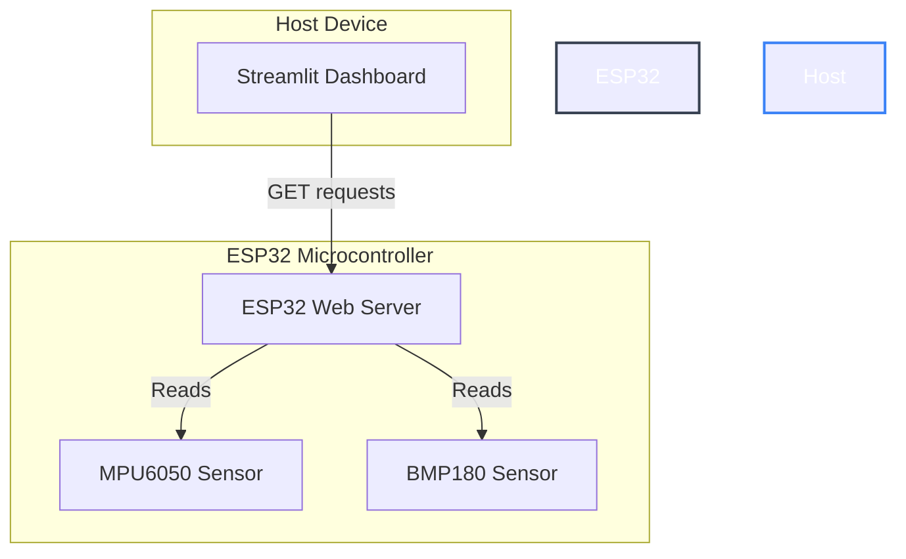

# 🚀 ESP32 Direct Telemetry & Sensor Dashboard

An IoT project that reads real-time telemetry from multiple sensors connected to an ESP32 microcontroller, exposes it via a local HTTP JSON API, and visualizes it dynamically on a Streamlit dashboard.

---

## 📌 Project Overview

This project consists of two core components:
1. **ESP32 Firmware (`original_firmware/`)**:
   - Configures the ESP32 as a Wi-Fi Access Point (AP).
   - Initializes two separate I2C buses to communicate with an **MPU6050** (accelerometer/gyroscope) and a **BMP180** (barometric pressure/temperature/altitude sensor).
   - Hosts a local HTTP WebServer serving a clean JSON telemetry endpoint at `http://192.168.4.1/data`.

2. **Streamlit Dashboard App (`app.py`)**:
   - A modern, reactive Python dashboard.
   - Periodically fetches the JSON telemetry data directly from the ESP32.
   - Renders live sensor metrics, including spatial orientation (accel/gyro) and environmental parameters (temp/pressure/altitude).

---

## 🏗️ Architecture & Data Flow



---

## 🔌 Hardware Setup & Wiring

### Component List
- **ESP32 development board** (e.g., ESP32 NodeMCU)
- **MPU6050** 6-Axis Accelerometer & Gyroscope
- **BMP180** Barometric Pressure & Temperature Sensor
- Breadboard & Jumper wires

### Pin Mapping (Dual I2C Bus Configuration)
To avoid address conflicts or bus loading, the firmware uses two independent I2C buses:

| Sensor | Sensor Pin | ESP32 Pin | Bus Type |
| :--- | :--- | :--- | :--- |
| **BMP180** | SDA | **GPIO 18** | Wire 0 (I2CBMP) |
| **BMP180** | SCL | **GPIO 19** | Wire 0 (I2CBMP) |
| **MPU6050** | SDA | **GPIO 21** | Wire 1 (I2CMPU) |
| **MPU6050** | SCL | **GPIO 22** | Wire 1 (I2CMPU) |
| **All Sensors** | VCC | **3.3V** | Power |
| **All Sensors** | GND | **GND** | Ground |

---

## 💾 ESP32 Firmware Installation

### 1. Requirements
Ensure you have the **Arduino IDE** (or VS Code with PlatformIO) installed.

### 2. Dependencies
Open Arduino Library Manager and install:
- `Adafruit BMP085 Library` (for BMP180 compatibility)
- `MPU6050_tockn` by tockn (for accelerometer & gyroscope offset calibration and readings)

### 3. Uploading
1. Open [original_firmware.ino](file:///c:/Users/user1/OneDrive/Desktop/iot%20fota%20mqtt/original_firmware/original_firmware.ino) in Arduino IDE.
2. Select your ESP32 board and the correct COM port.
3. Compile and upload the sketch.
4. Open the Serial Monitor at `115200` baud rate to view system logs and sensor initialization outputs.

---

## 💻 Streamlit Dashboard Setup

### 1. Prerequisites
- Python 3.8 or higher installed on your computer.

### 2. Installation
Install the required Python dependencies:
```bash
pip install -r requirements.txt
```

### 3. Connecting to the ESP32 AP
1. On your computer, open your Wi-Fi settings.
2. Scan for and connect to the network:
   - **SSID**: `ESP32_Project`
   - **Password**: `12345678`
3. Once connected, your computer's IP address will be assigned by the ESP32 (typically `192.168.4.2`).

### 4. Running the Dashboard
Run the following command in your terminal from the project root directory:
```bash
streamlit run app.py
```
A browser tab should open automatically displaying the live dashboard at `http://localhost:8501`.

---

## 🌐 API Reference

When connected to the `ESP32_Project` AP, you can fetch raw sensor data by visiting `http://192.168.4.1/data`.

**Sample JSON Response:**
```json
{
  "status": "RUNNING",
  "version": "3.0.0",
  "mpu6050": {
    "accel": {
      "x": 0.05,
      "y": -0.02,
      "z": 0.98
    },
    "gyro": {
      "x": -0.15,
      "y": 1.22,
      "z": -0.05
    }
  },
  "bmp180": {
    "temp": 24.50,
    "pressure": 1013.25,
    "altitude": 120.50
  }
}
```

---

## 🔮 Future Roadmap (MQTT & FOTA Integration)
As indicated by the project folder (`iot fota mqtt`), future planned integrations include:
- **MQTT Protocol**: Publish telemetry data to a central broker (e.g., HiveMQ, Mosquitto) instead of hosting a local HTTP endpoint, allowing remote cloud-based dashboarding.
- **FOTA (Firmware Over The Air)**: Enable firmware updates directly over Wi-Fi, using either ESP32's built-in OTA libraries or an MQTT-triggered update service.
